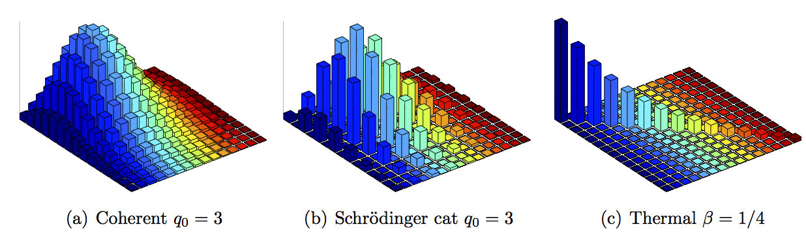

This Matlab package contains the source code to reproduce the figure of the article:

P. Alquier, K. Meziani, G. Peyré. [Adaptive estimation of the density matrix in quantum homodyne tomography with noisy data](http://arxiv.org/abs/1301.7644). Inverse Problems, 29(7), pp. 075017, 2013.

Copyright (c) 2013 Gabriel Peyré
